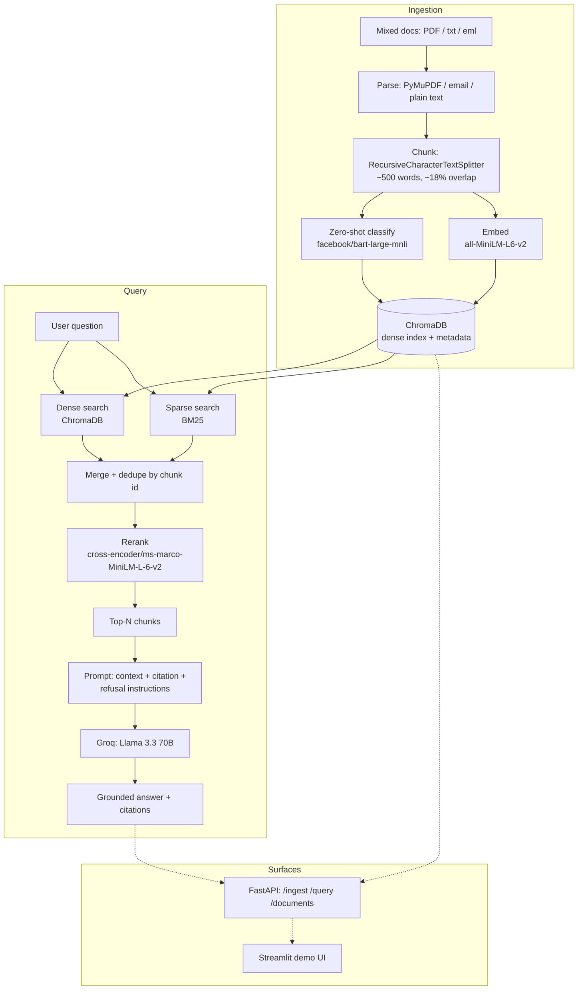

# Enterprise Document Intelligence (RAG)

A Retrieval-Augmented Generation system for querying a mixed corpus of enterprise
documents — security policies, financial reports, HR docs, customer support tickets,
legal/compliance documents, and engineering docs — with grounded, cited answers.

Built as a portfolio project demonstrating the core information-management problem
enterprises face: unstructured content sitting in mixed formats (PDF, email, plain
text) that needs to be automatically classified, indexed, and made searchable with
trustworthy, sourced answers rather than a black-box chatbot.

## What it demonstrates

- **Unstructured data handling** — PDF, `.eml` (email), and plain text parsed through
  a unified ingestion pipeline with per-file failure isolation (a bad file is logged
  and skipped, not a crash).
- **Document classification / metadata tagging** — every document is tagged with a
  category (security policy, financial report, HR, customer support, legal/compliance,
  engineering docs) and a confidence score via zero-shot classification.
- **NLP fundamentals** — tokenization (BM25), dense embeddings, semantic search.
- **Transformers** — used both for embeddings (`sentence-transformers`) and
  classification (`facebook/bart-large-mnli` zero-shot).
- **Full RAG pipeline** — chunking with overlap, hybrid indexing, retrieval,
  citation-grounded generation.
- **Hybrid retrieval** — dense (semantic) + sparse (BM25 keyword) search merged and
  reranked with a cross-encoder.
- **LLM integration** — prompt engineering that enforces citation and refusal
  behavior, backed by the Groq API (Llama 3.3 70B).
- **Evaluation** — quantitative RAG quality metrics via RAGAS (faithfulness, answer
  relevancy, context precision), not just "it works."
- **API design** — the pipeline is exposed as FastAPI endpoints, not a script.
- **Deployment** — a public Streamlit Community Cloud demo.

## Architecture



## Project structure

```
rag-document-intelligence/
├── data/sample_docs/       # 24 synthetic enterprise documents (pdf/txt/eml)
├── src/
│   ├── config.py           # shared settings, env-driven
│   ├── ingest.py           # load -> chunk -> classify -> embed -> store
│   ├── retrieval.py        # hybrid dense+sparse retrieval + reranking
│   ├── generate.py         # Groq call with citation-grounded prompting
│   ├── evaluate.py         # RAGAS evaluation harness
│   └── api.py               # FastAPI endpoints wrapping the pipeline
├── app.py                  # Streamlit demo UI
├── tests/test_pipeline.py  # unit tests for chunking/parsing/retrieval
├── scripts/generate_sample_pdfs.py  # one-off generator for the sample PDFs
├── requirements.txt
├── .env.example
└── evaluation_results.json # RAGAS output (generated by src/evaluate.py)
```

## Setup

1. **Install dependencies** (Python 3.10+):
   ```bash
   pip install -r requirements.txt
   ```
2. **Configure your API key**:
   ```bash
   cp .env.example .env
   # then edit .env and set GROQ_API_KEY (free tier: https://console.groq.com/keys)
   ```
3. **Ingest the sample corpus**:
   ```bash
   python -m src.ingest
   ```
   This parses, classifies, embeds, and indexes all 24 documents in `data/sample_docs`
   into a persistent ChromaDB store at `./chroma_store`.
4. **Run the API**:
   ```bash
   uvicorn src.api:app --reload
   ```
   Then `POST /query` with `{"question": "..."}`, or `GET /documents` to see the
   tagged corpus.
5. **Run the Streamlit demo**:
   ```bash
   streamlit run app.py
   ```
6. **Run evaluation**:
   ```bash
   python -m src.evaluate
   ```
   Writes `evaluation_results.json` with RAGAS scores.
7. **Run tests**:
   ```bash
   pytest tests/
   ```

## Evaluation results

### Document classification accuracy

Running zero-shot classification (`facebook/bart-large-mnli`) over all 24 synthetic
documents against the fixed 6-label set produced **20/24 correct (83%)** against the
known ground-truth category each document was written for:

| Category | Correct | Notes on misses |
|---|---|---|
| Engineering documentation | 4/4 | — |
| Security policy | 4/4 | — |
| Financial report | 3/4 | `finance_expense_audit_report.pdf` → tagged "legal and compliance" (plausible: it's an internal-audit/controls document) |
| Legal and compliance | 3/4 | `legal_vendor_contract_summary.txt` → tagged "customer support" (mentions the HelpDeskly support platform heavily) |
| HR | 3/4 | `hr_remote_work_policy.txt` → tagged "security policy" (dominated by VPN/encryption requirements) |
| Customer support | 3/4 | `support_ticket_4524_feature_request.eml` → tagged "HR" |

This is a realistic result for zero-shot classification on documents that legitimately
straddle two categories, and is exactly the tradeoff discussed below — it's usable
out of the box with zero labeled data, at a real accuracy cost versus a fine-tuned
classifier.

### RAG quality (RAGAS)

See [`evaluation_results.json`](evaluation_results.json) for full per-question output.
RAGAS was run against a 14-question set spanning all six document categories, plus a
separate qualitative check of refusal behavior on 2 intentionally unanswerable
questions (asking for facts never present in the corpus, e.g. a stock ticker symbol).

> **Note on the model used for evaluation:** the evaluation run (both the 14 answers
> being scored and the RAGAS judge itself) used `llama-3.1-8b-instant` rather than
> the `llama-3.3-70b-versatile` model the live app defaults to. This was a deliberate
> choice to reliably fit the full 14-question, 3-metric run (56 total LLM calls)
> within Groq's free-tier rate limits during development, on a token budget fully
> isolated from whatever the live demo has already spent against the 70B model's
> separate quota. The deployed application and API still default to
> `llama-3.3-70b-versatile` (`GROQ_MODEL`) for actual generation; only the automated
> evaluation harness overrides the model via `GROQ_JUDGE_MODEL`.

| Metric | Score | What it measures |
|---|---|---|
| **Faithfulness** | **0.90** | Fraction of claims in the generated answer that are actually supported by the retrieved context (higher = less hallucination) |
| **Answer relevancy** | **0.93** | How directly the answer addresses the question asked |
| **Context precision** | **0.96** | How relevant the retrieved chunks are, weighted by their rank (higher = the reranker is surfacing the right evidence near the top) |

**Refusal behavior: 2/2 correct.** Both intentionally unanswerable questions ("What is
Nimbus Analytics' stock ticker symbol?" and "Who is the current CEO of Nimbus
Analytics?") correctly triggered the "I don't have enough information" refusal
instead of a hallucinated guess.

All three RAGAS scores are strong (faithfulness and answer relevancy both above 0.9,
context precision above 0.95), consistent with citation-grounded prompting doing its
job. The lowest-scoring individual answer was faithfulness 0.50 on *"What was Nimbus
Analytics' revenue in Q1 2026?"*, which the system answered as a single sentence —
*"Nimbus Analytics' revenue in Q1 2026 was $18.4M [finance_q1_2026_earnings_summary.pdf]"*
— fully and correctly supported by the retrieved context. The low score here is best
attributed to noise from the judge model rather than an actual grounding failure: the
evaluation harness deliberately uses a smaller/faster model (`llama-3.1-8b-instant`,
see note above) as the RAGAS judge to fit within free-tier quota limits, and 8B-class
models are noticeably less reliable at RAGAS's internal claim-decomposition step than
larger judge models would be. This is a real limitation of the evaluation setup worth
naming honestly, not a case of the generation pipeline inventing content.

## Design decisions

**Why hybrid retrieval (dense + sparse), not just embeddings?**
Dense embeddings are good at semantic similarity but blur past exact identifiers that
matter constantly in enterprise search — ticket numbers ("Ticket #4522"), project IDs,
dollar figures, policy names. BM25 catches exact keyword/entity matches that
embedding similarity can miss or under-rank. Running both and merging recovers
recall either retriever alone would lose.

**Why rerank with a cross-encoder after merging?**
Dense cosine similarity and BM25 scores live on incomparable scales, so merging by a
naive weighted sum is a rough heuristic at best. A cross-encoder scores each
(query, chunk) pair jointly rather than comparing pre-computed vectors, which is far
more accurate at judging true relevance — but too slow to run over an entire corpus.
Running it only on the small merged candidate set (dense top-k + sparse top-k,
deduplicated) gets the accuracy benefit at a cost that's still cheap.

**Why zero-shot classification instead of a fine-tuned model?**
There's no labeled training set for this corpus (as is true for most net-new
enterprise document collections on day one). Zero-shot classification
(`facebook/bart-large-mnli`) lets the system tag documents against a fixed enterprise
label set with no training step, which is exactly the kind of "instant value on
unstructured content" capability that matters for a first-pass enterprise ingestion
pipeline. A fine-tuned classifier would out-perform it given labeled data, and is a
natural next step once user corrections start accumulating.

**Why classify at the document level, not per-chunk?**
Running a ~400M-parameter zero-shot model on every chunk of every document is
expensive for marginal benefit — a document's category rarely changes chunk to
chunk (a security policy doesn't suddenly become a financial report halfway
through). Classifying once per document and propagating the label to all its chunks
keeps ingestion fast without sacrificing tagging quality in practice.

**Why citation-grounded generation with explicit refusal?**
The single biggest risk in enterprise RAG is a confident, wrong answer synthesized
from the model's general knowledge instead of the actual source documents. The
generation prompt forces every claim to cite a source filename and requires the model
to say "I don't have enough information" when the retrieved context doesn't cover the
question, rather than guessing. This is verified directly in evaluation via the
refusal-behavior checks.

**Why RAGAS instead of eyeballing answers?**
"It works on the examples I tried" doesn't scale and isn't defensible. RAGAS gives
three separate, interpretable numbers — faithfulness (hallucination), answer
relevancy (did it answer the actual question), and context precision (did retrieval
surface the right chunks) — which separate generation quality from retrieval quality
instead of conflating them into one vague impression.

## API reference

| Endpoint | Method | Description |
|---|---|---|
| `/ingest` | POST | Upload one or more files (multipart); runs the full parse → chunk → classify → embed → store pipeline. |
| `/query` | POST | `{"question": "..."}` → grounded answer + cited sources. |
| `/documents` | GET | Lists every ingested document with its tagged category and confidence. |

## Deployment

Deployed to Streamlit Community Cloud: **[link to be added after deployment]**

See [DEPLOYMENT.md](DEPLOYMENT.md) for the exact steps to deploy this yourself.
